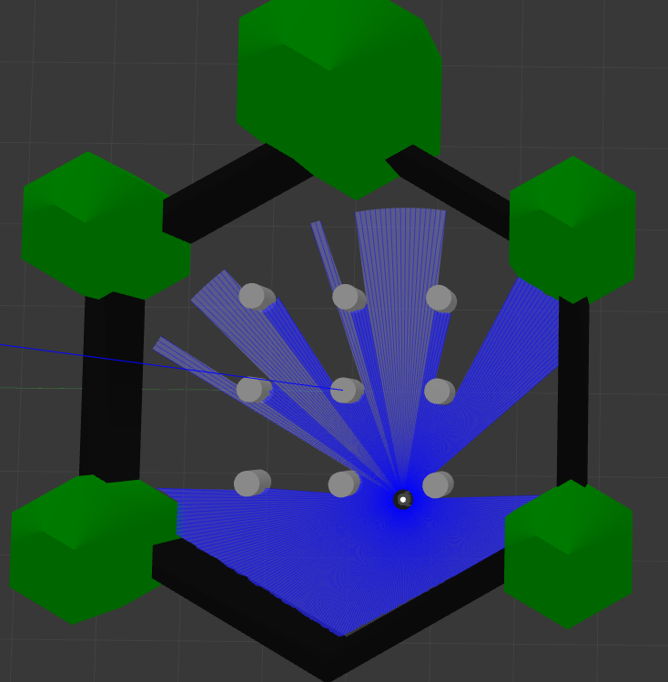

[](https://opensource.org/licenses/BSD-3-Clause)
# ROS2 Turtlebot Practice
This repository is to practice integration with Gazebo with the turtlebot tools.  
A turtlebot will be walking around in gazebo with simple bump-and-go obstacle avoidance strategy.  

  

### Table of contents
- [**Dependencies**](#dependencies)
- [**Install**](#install)
- [**Docs**](#docs)
- [**Build**](#build)
- [**Run**](#run)
- [**Result**](#result)
- [**Rosbag**](#rosbag)

## Dependencies
- [ROS2](https://docs.ros.org/en/foxy/Installation.html) 
- [Gazebo](http://classic.gazebosim.org/tutorials?tut=ros2_installing&cat=connect_ros)  
- [Doxygen](https://www.doxygen.nl/download.html) (Optional for generating docs)  

### ROS2 packages
- turtlebot3_gazebo

Install packages with command
```
cd {ros2_ws}/src
rosdep update
rosdep install -r --from-paths . --ignore-src --rosdistro $ROS_DISTRO -y
```

### Testing Environment
- Ubuntu 20.04
- ROS2 Foxy

## Install
Clone the repository to your ros2 workspace src folder
```
cd {ros2_ws}/src
git clone https://github.com/longhongc/ROS2-turtlebot-practice.git
```
## Docs
Create doxygen docs with this command.  
The doxygen docs will be export to the docs folder  
```
cd {ros2_ws}
doxygen Doxyfile
```
## Build
Source your ros2 workspace  
Setup.bash can be .zsh, depends on your shell  
```
cd {ros2_ws}
colcon build --packages-select ROS2-turtlebot-practice
source {ros2_ws}/install/setup.bash
```

## Run
Launch gazebo and ros code.  
A turtlebot will appear in gazebo and start walking.
```
ros2 launch ros2_turtlebot_practice start_walker.launch.py
```

Rosbag can be record at the same time by setting the argument record to true.  
```
ros2 launch ros2_turtlebot_practice start_walker.launch.py record:=true
```

## Result
  

## Rosbag
A rosbag is already recorded in the results folder.  
Run rosbag with command `ros2 bag play {name of rosbag folder}`  
Inspect rosbag information with command `ros2 bag info {name of rosbag folder}` 
